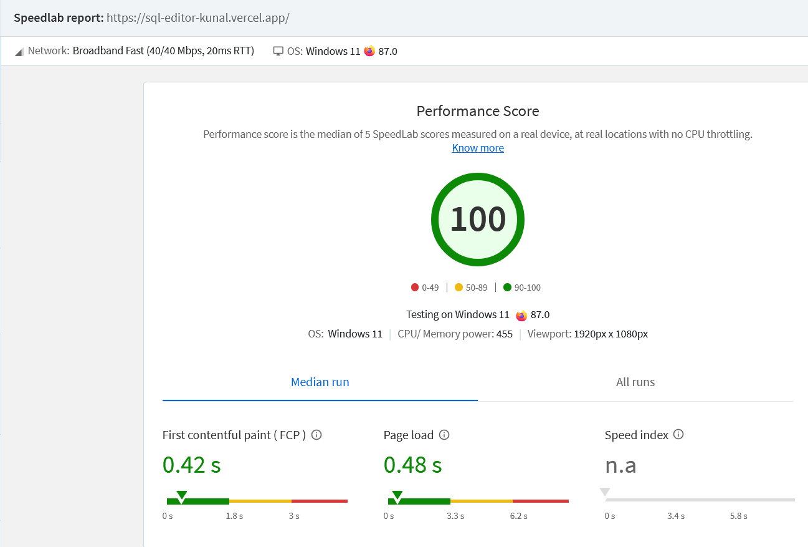
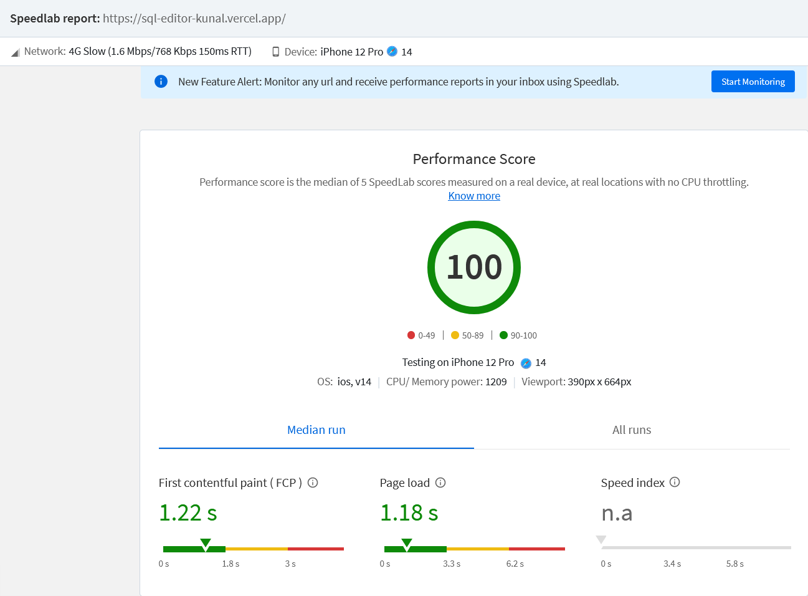

# SQL Runner: A lightweight SQL Editor

## Introduction
SQL Runner is a frontend only, SPA web application that provides users the ability to run their SQL queries on their CSV datasets that are loaded by providing Github API link of the hosted dataset and provides instant output in the form of table that can be exported as CSV file for later use. The app is freated using React, plain CSS and recoil for state management. It uses alasql, a lightweight browser based database to run the queries and give correct output. The user can run not only the already saved queries but also the new simple queries based on the tables available.

## Live Demo
SQL Runner is hosted at Vercel. It can be accessed at ->  [SQL Runner](https://sql-editor-kunal.vercel.app/)

## Features
1) Editor with syntax highlighting for SQL.
2) Simple queries can be run on the available tables.
3) Editor contains three buttons -> Run button to run the queries, Save & run button to run the query and save it if valid. Clear button to clear the editor.
4) User can access list of saved tables available and can add a new table by providing name of the table and Github API link of CSV dataset.
5) User can link on the table name in the list to view the corresponding dataset.
6) User has access to saved queries available in the form of list.
7) User can also see the history of queries run by the user whether valid or invalid.
8) User can click on any of the query in Saved or Histor section and it gets pasted to the editor.
9) The page is made responsive and functional on mobile screen using media queries and dynamic units - vh and vw.

## Structure
The page is made such that user can access all the functionality at one-stop without navigating to next page. Therefore the whole page is divided into 6 sections in general:- 
1) Saved Tables section - It renders a list of saved tables availbale
2) Add Table section - It enables user to upload new table for querying
3) Editor section - It provides text editor with syntax highlighting to write SQL queries.
4) Output section - It shows output table based on the query run by the user.
5) Saved Query section - It renders the list of queries saved by the user.
6) History section - It renders list of queries already run by the user

## How it Works ?
* Once the user has written the query and clicks on run button, the app checks whether the written is correct or not based on whether it contains FROM keyword or     not.
* If the query is valid, the table name is fetched from the query using string manipulation and this table name is used to retirieve CSV data from the link given.
* After getting the table name, it is used to retrieve CSV data. Firstly, the table name is used to lookup in the local storage. If available in the local storage,   the CSV data is retrieved from there.
* If not, the fetch API is used to request JSOn data from the github API link given and then the JSON data is decoded to get clean CSV data. This CSV data is     
   stored in local storage for future reference and returned back to the app.
*  The retrieved CSV data is used by alasql to run the given query and produce output. If the query is simple and valid, result in the form of JSON is produced 
   else not.
*  The resulting JSOn is then rendered in the form of table which can be exported using export button

##  Tech stack and Dependencies
1) React - To build lightweight SPA
2) Plain CSS - To style the react components thus no use of UI kits like Shaden UI or Chakra required.
3) Recoil - Recoil is used for state management and preferred above Redux and Context because for multiple states, context becomes complex and requires more 
   providers whereas Redux is not used because it requires complex boilerplate as compared to minimal boilerplate in Recoil.
4) react-simple-code-editor - Text editor without any extra unrequired functionalities
5) prismjs - For syntax highlighting
6) react-hot-toast - To display toast notifications to the users
7) react-loader-spinner - To display spinner during fallback
8) react-csv - To convert JSON to CSV and export CSV file.
9) react-icons - To display font awesome icons
10) alasql - To run queries and produce correct results

## Data used 
I have used and provided saved tables that have CSV data that was provided in the assignment doc. It can be accessed here -> [Data](https://github.com/graphql-compose/graphql-compose-examples/tree/master/examples/northwind/data/csv)

## Predefined Queries
Predefined queries for test usage are available in the saved queries list and any of them can be used or modified to produce output.

## Page Load Time
I have used various performance metrics like FCP, LCP, CLS to determine page load time nad performane of my website. According to verified resources available later the page load time for desktop ranges from 0.4s to 0.6s and 1s to 1.2s for mobile screens. The testament of these metrics is provided below in the form of official reports. Various metrics used are:-
* First Contentful Paint marks the time at which the first text or image is painted
* Speed Index shows how quickly the contents of a page are visibly populated.
* Total Blocking Time is the sum of all time periods between FCP and Time to Interactive, when task length exceeded 50ms, expressed in milliseconds.
* Largest Contentful Paint marks the time at which the largest text or image is painted.
* Cumulative Layout Shift measures the movement of visible elements within the viewport.

1) Lighthouse Chrome Extension
   Lighthouse Chrome Extension is the tool that I used widely to test the performance and improve it from the given suggestions and blogs.

   #### Lighthouse Report - Desktop
   

   #### Lighthouse Report - Mobile
   

 2) BrowserStack - Sppedlab
    Another tool that I used was speedlab as it specifically provided page load time metric to quantify and see the improvements in the performance.

   #### Speedlab Report - Desktop
   

   #### Speedlab Report - Mobile
   

 3) PageSpeed Insights
    Lastly, I used PageSpeed Insights to verify the final performance metrics. The report can be accessed at [PageSpeed](https://pagespeed.web.dev/analysis/https-sql-editor-kunal-vercel-app/q5fpzmwwyw?form_factor=desktop)

## Performance Optimization
Before beginning the optimization, when I checked for performance on Lighthouse, it showed 67 for desktop and 58 for mobile screens. After applying different performance optimizations, I was able to get a perfect 100 score in performance on both the devices. Similarly, I was able to decrease the page load time as measured by speedlab from 1.2s to 0.45s on desktops and from 1.8s to 1.1s on mobiles. Various approaches used by me are:-
1) Using code-splitting and lazy loading of React components that were not immediately required like the Table component. Similarly, I used code-splitting through dynamic imports for libraries that were not initially required. For instance, I dynamically imported alasql library as it was only required after the query was run. This helped in reducing the bundle size and reducing unused javascript.
2) Secondly, I used performance hooks useCallback, useMemo and memo for memoization of the React components and functions to reduce unwanted re-renders. I used 
    profiler for checking the unwanted re-renders and minimizing them through performance hooks.
3) I used various suggestions available in lighthouse report to individually reduce different metrics like FCP, LCP, CLS and TBT. For instnace, using fixed dimensions to prevent cummulative layout shift. doing so, I reduced the CLs from 0.125 to 0.002 considerably.
4) Hosted the website on Vercel due to its renowned CDNs and caching benefits.
5) Using minimal dependencies and UI kits to prevent large bundle size. like using react-simple-code-editor which is just 10.9kb instead of famous ACE (1.7MB) or Codemirror(760kb) code editor

## Challenges
I tried using virtualization for rendering rows of the table by using react-windows and react-virtualized. But in react-window, horizontal scrolling was not avaiable and use of semantic table tags was not possible making it less accessible. Similarly, I tried using table of react-virtualized but it was ineffective and provided bad Ux experience as the cells of table were of fixed width and didn't fit the content and also horizontal scrolling was not possible. Thus to provide better accessibilty and User experience, I didn't use react-windowsor virtualized.

## Future Scope
* Allow User to visualize output data in form of charts and graphs using recharts.
* Allowing user to upload CSV dataset and storing it in some data resource like cloudinery or s3 buckets.
* Allowing user to run nested queries also successfully
